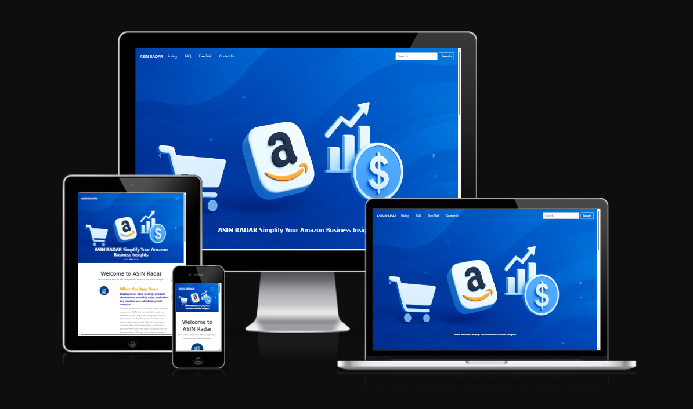
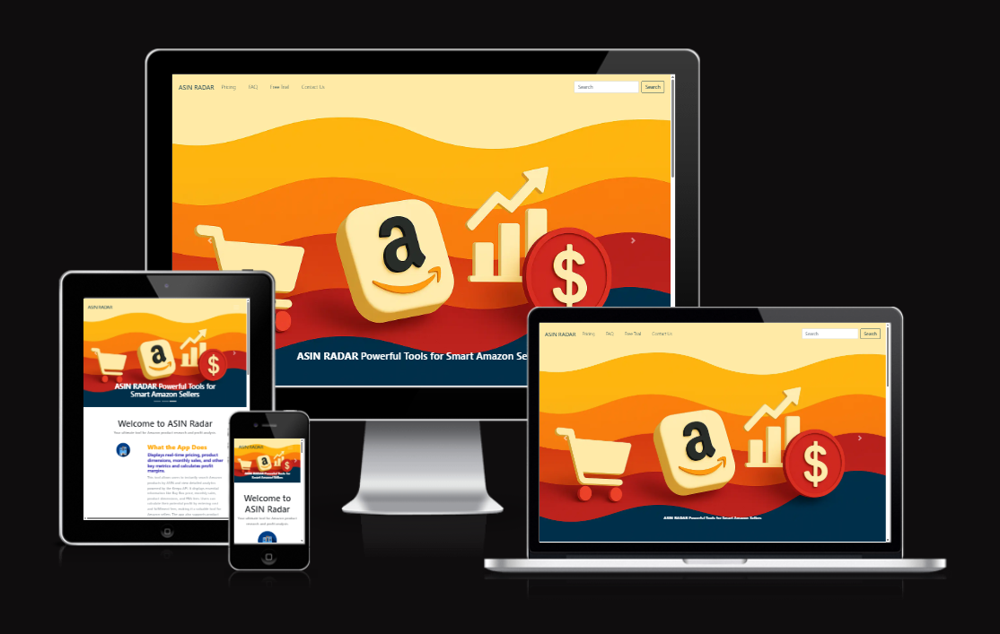

# ASIN RADAR

ASIN RADAR is a powerful web application designed specifically for Amazon sellers who want to discover profitable products and uncover new opportunities for their business.

With ASIN RADAR, you can:

Instantly analyze product performance using ASIN numbers

Track market trends and price history

Identify high-demand, low-competition products

Explore new niches and product ideas to grow your Amazon store

Whether you're an experienced seller or just starting out, ASIN RADAR helps you make smarter, data-driven decisions to boost your profits and stay ahead in the competitive Amazon marketplace.

[View ASIN RADAR on Github Pages](https://mubashirgit1.github.io/asinradar/)

---
## CONTENTS

* [User Experience](#user-experience-ux)
  * [User Stories](#user-stories)

* [Design](#design)
  * [Colour Scheme](#colour-scheme)
  * [Typography](#typography)
  * [Imagery](#imagery)
  * [Wireframes](#wireframes)

* [Features](#features)
  * [General Features on Each Page](#general-features-on-each-page)
  * [Future Implementations](#future-implementations)
  * [Accessibility](#accessibility)

* [Technologies Used](#technologies-used)
  * [Languages Used](#languages-used)
  * [Frameworks, Libraries & Programs Used](#frameworks-libraries--programs-used)

* [Deployment & Local Development](#deployment--local-development)
  * [Deployment](#deployment)
  * [Local Development](#local-development)
    * [How to Fork](#how-to-fork)
    * [How to Clone](#how-to-clone)

* [Testing](#testing)

* [Credits](#credits)
  * [Code Used](#code-used)
  * [Content](#content)
  * [Media](#media)
  * [Acknowledgments](#acknowledgments)

---

## User Experience (UX)

### Initial Discussion

As an Amazon seller,
I want to enter an ASIN in a simple search field
So that I can instantly view product data like price, brand, monthly sales, and dimensions
And calculate potential profit using cost and FBA fees.te.

#### Key information for the site

* Purpose: Quickly analyze Amazon products using ASIN with real-time pricing, sales, and profit estimates.

* Main Features:

* Search by ASIN across all pages

* Instant Buy Box price and monthly sold estimates

* Auto-calculated profit based on FBA fees and cost

* Product details including dimensions, weight, EAN, and material

* Variation preview with images

### User Stories

#### Client Goals

* To be able to view the site on a range of device sizes.
* Allow users to quickly analyze Amazon ASINs for competitive insights.
* Provide real-time Buy Box pricing, profit estimation, and sales data to help sellers choose winning products.
* Reduce manual lookup time by integrating Keepa API and automated calculations.

#### First Time Visitor Goals

* I want to find out ASIN Profit.
* I want to be able to check dimension and other details.
* I want to be able to find image of product.

#### Returning Visitor Goals

* I want to find up to date information Variation of Product.
* I want to be able to easily description.
* I want to be able to search from all app.

#### Frequent Visitor Goals

* I want to be able to search asin find profitable products.

- - -

### Colour Scheme

Here is the color scheme for the project:
- **Prussian Blue**: `#003049ff`
- **Fire Engine Red**: `#d62828ff`
- **Orange Wheel**: `#f77f00ff`
- **Xanthous**: `#fcbf49ff`
- **Vanilla**: `#eae2b7ff`

Resource
https://coolors.co/user/palettes/6852bea9b6b194000bfbd483

### Typography

Google Fonts was used for the following fonts:

* Merriweather is used for headings on the site. It is a serif font.

* Raleway is used for the body text on the site. It is a sans-serif font.  

* Indie Flower is used on the thank you page for Harrison Fords message. It is a cursive font.

### **Wireframes**

Wireframes for the website were created using **Figma**.
Click to view the **website wireframes** [here](https://www.figma.com/design/4mJYRwrJnmsoifzWiK1tJQ/ASIN-RADAR?node-id=0-1&m=dev&t=gptwWji70jXKvfB0-1).

