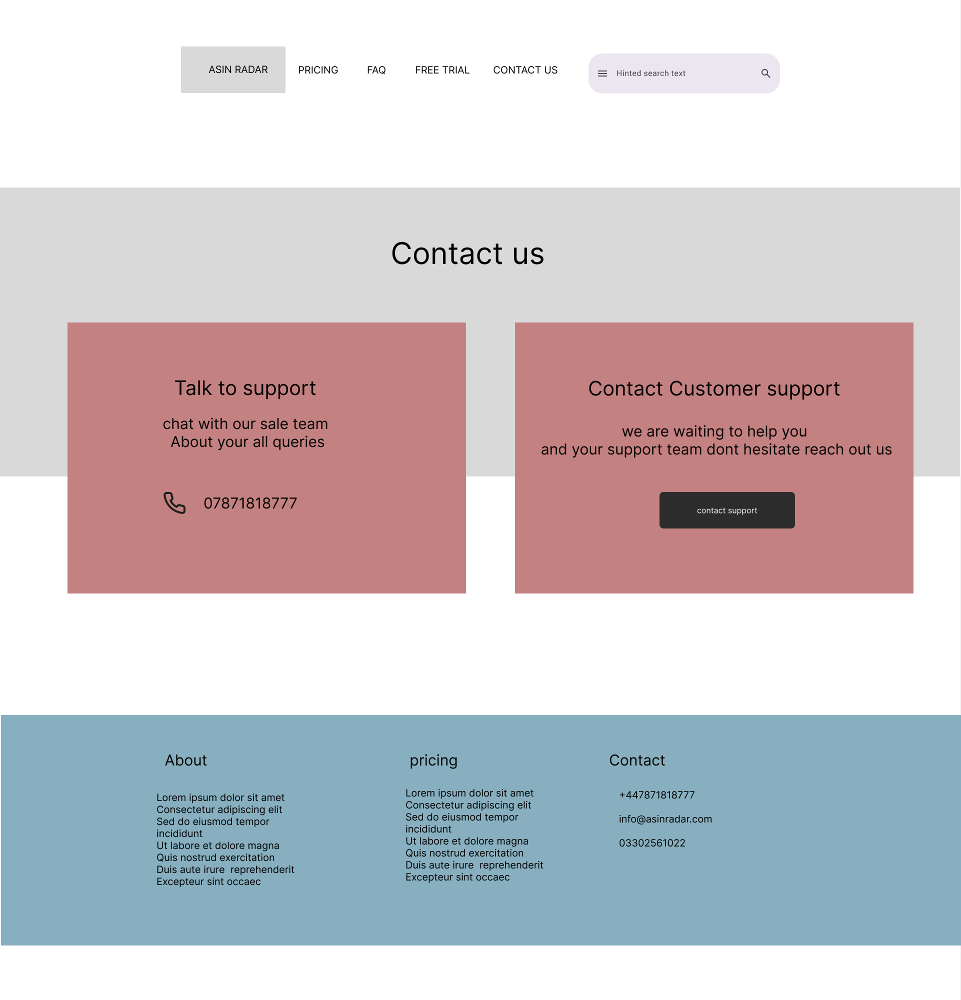

# ASIN RADAR

ASIN RADAR is a powerful web application designed specifically for Amazon sellers who want to discover profitable products and uncover new opportunities for their business.

With ASIN RADAR, you can:

Instantly analyze product performance using ASIN numbers

Track market trends and price history

Identify high-demand, low-competition products

Explore new niches and product ideas to grow your Amazon store

Whether you're an experienced seller or just starting out, ASIN RADAR helps you make smarter, data-driven decisions to boost your profits and stay ahead in the competitive Amazon marketplace.

[View ASIN RADAR on Github Pages](https://mubashirgit1.github.io/asinradar/)

---

## CONTENTS

- [User Experience](#user-experience-ux)

  - [User Stories](#user-stories)

- [Design](#design)

  - [Colour Scheme](#colour-scheme)
  - [Typography](#typography)
  - [Imagery](#imagery)
  - [Wireframes](#wireframes)

- [Features](#features)

  - [General Features on Each Page](#general-features-on-each-page)
  - [Future Implementations](#future-implementations)
  - [Accessibility](#accessibility)

- [Technologies Used](#technologies-used)

  - [Languages Used](#languages-used)
  - [Frameworks, Libraries & Programs Used](#frameworks-libraries--programs-used)

- [Deployment & Local Development](#deployment--local-development)

  - [Deployment](#deployment)
  - [Local Development](#local-development)
    - [How to Fork](#how-to-fork)
    - [How to Clone](#how-to-clone)

- [Testing](#testing)

- [Credits](#credits)
  - [Code Used](#code-used)
  - [Content](#content)
  - [Media](#media)
  - [Acknowledgments](#acknowledgments)

---

## User Experience (UX)

### Initial Discussion

As an Amazon seller,
I want to enter an ASIN in a simple search field
So that I can instantly view product data like price, brand, monthly sales, and dimensions
And calculate potential profit using cost and FBA fees.te.

#### Key information for the site

- Purpose: Quickly analyze Amazon products using ASIN with real-time pricing, sales, and profit estimates.

- Main Features:

- Search by ASIN across all pages

- Instant Buy Box price and monthly sold estimates

- Auto-calculated profit based on FBA fees and cost

- Product details including dimensions, weight, EAN, and material

- Variation preview with images

### User Stories

#### Client Goals

- To be able to view the site on a range of device sizes.
- Allow users to quickly analyze Amazon ASINs for competitive insights.
- Provide real-time Buy Box pricing, profit estimation, and sales data to help sellers choose winning products.
- Reduce manual lookup time by integrating Keepa API and automated calculations.

#### First Time Visitor Goals

- I want to find out ASIN Profit.
- I want to be able to check dimension and other details.
- I want to be able to find image of product.

#### Returning Visitor Goals

- I want to find up to date information Variation of Product.
- I want to be able to easily description.
- I want to be able to search from all app.

#### Frequent Visitor Goals

- I want to be able to search asin find profitable products.

---

### Colour Scheme

Here is the color scheme for the project:

- **Prussian Blue**: `#003049ff`
- **Fire Engine Red**: `#d62828ff`
- **Orange Wheel**: `#f77f00ff`
- **Xanthous**: `#fcbf49ff`
- **Vanilla**: `#eae2b7ff`

Resource
https://coolors.co/user/palettes/6852bea9b6b194000bfbd483

### Typography

We use a system UI font stack to provide a clean, fast, and native look across platforms:

This stack prioritizes the default fonts of:

🖥 macOS / iOS: -apple-system, Helvetica Neue, Apple Color Emoji

💻 Windows: "Segoe UI", "Segoe UI Emoji", "Segoe UI Symbol"

🤖 Android: Roboto, "Noto Color Emoji"

🧭 Fallbacks: Arial, sans-serif for broad compatibility

### Imagery

Our homepage slider consists of three responsive slides, each designed to highlight key features of the ASIN RADAR platform:

1. Track Amazon Fees, Profit & Product Performance

2. Simplify Your Amazon Business Insights

3. Powerful Tools for Smart Amazon Sellers

All slider images were custom-designed using ChatGPT assistance and integrated into a Bootstrap carousel.

### **Wireframes**

The initial design and layout of this project were conceptualized using Figma. These wireframes served as the foundation for the UI/UX structure, ensuring a clear visual direction before development began.

📐 Tool used: Figma

🎯 Purpose: To define the layout, content hierarchy, and user flow across key pages/components.

Click to view the **website wireframes** [here](https://www.figma.com/design/4mJYRwrJnmsoifzWiK1tJQ/ASIN-RADAR?node-id=0-1&m=dev&t=gptwWji70jXKvfB0-1).

Home Page

Pricing

Frequently Asked Questions

Search

After Search

Contact Us

### Features

The website is contain Home page, a Pricing page, a FAQ page, a Contact us page, a thank you page & a search Page page.

All Pages on the website are responsive and have:

#### Favicon

- A favicon in the browser tab.

  

  - The navigation of the site at the top of every page. link to all pages each other click on logo back to home page.

  * Home page Navigation is transparent background top of slider
  * on last slider navigation color change to balck using jquery sort the color combination

#### Navigation

- Navigation of All Other pages same have search on where user search asin as well.

* Home page Navigation is transparent background top of slider

#### Homepage Slider

The homepage features a responsive carousel slider designed to visually communicate the core value propositions of the ASIN RADAR platform. Each slide combines strong messaging with thematic imagery that reinforces the platform's benefits for Amazon sellers.

- **Slider Overview**:

1. Track Amazon Fees, Profit & Product Performance

- Showcases the ASIN RADAR logo and Amazon-themed icons, emphasizing real-time tracking and performance analytics.

2. Simplify Your Amazon Business Insights

- Uses a visual of an Amazon shopping basket to highlight how ASIN RADAR makes seller data easy to understand and act on.

3. Powerful Tools for Smart Amazon Sellers

- Displays themed design layers and visual elements aligned with ASIN RADAR branding, positioning the platform as a professional toolkit for serious sellers.

- **Built With**:
  Bootstrap Carousel (.carousel, .carousel-item)

Responsive Images with full-width scaling (img-fluid, w-100)

Custom Text Animations using WOW.js and CSS transitions for engaging headlines

#### App features

1. What the App Does
2. Key features
3. Security & Performance
4. Flexible Pricing Plans

#### Footer Structure

The footer of the ASIN RADAR website is designed to provide quick access to essential links, contact details, and engagement options. The layout follows a right-to-left hierarchy, making key information immediately accessible and enhancing usability.

🧭 Footer Content (Right to Left):

1. Logo and Slogan

Positioned at the far right of the footer.

Includes the ASIN RADAR logo alongside a short, memorable slogan to reinforce brand identity.

2. Contact & More Info

Contains contact details like phone numbers and support email.

May also include quick links to the help center or business inquiries.

3. Footer Navigation

A compact set of links for easy access to key pages such as:

- Home

- Pricing

- FAQ

- Free Trial

- Contact Us

4. Newsletter & Social Media Icons

Newsletter signup input (if applicable).

Social media icons (e.g., instagram , Facebook) allow users to connect with ASIN RADAR on various platforms.

#### Pricing Page

Display all pricing options for user with details

Discover a plan that fits your needs — simple, transparent, and affordable.

| Plan        | Price/Month | Devices          | Request Limit         | Support      |
| ----------- | ----------- | ---------------- | --------------------- | ------------ |
| **Small**   | £23         | 2 Device Logins  | 5 Requests / minute   | 24/7 Support |
| **Medium**  | £35         | 5 Device Logins  | 10 Requests / minute  | 24/7 Support |
| **Advance** | £49         | 10 Device Logins | 100 Requests / minute | 24/7 Support |

#### FAQ Page

Write down some common questions most of suer asked us

1. What is ASIN Radar?
   ASIN Radar is a tool designed to help Amazon sellers track and monitor ASINs for price changes, stock status, and listing updates in real time.

2. How do I add an ASIN to track?
   Simply log in to your ASIN Radar account, navigate to your dashboard, click Add ASIN, enter the ASIN, and set your alerts.

3. Is ASIN Radar free to use?
   It offers both free and premium plans. The free plan includes basic tracking; the premium plan adds advanced alerts, historical data, and competitor analysis.

4. How often is ASIN data updated?
   Premium users get near real-time updates; free users get updates every 6 hours.

5. What data does this app provide?
   It shows Amazon product details including Buy Box price, monthly sales estimates, product dimensions, FBA fees, and variations to help you make informed decisions.

6. Does ASIN Radar support international Amazon marketplaces?
   No—currently it only supports Amazon UK.

7. How often can I make API requests?
   You can make up to 60 API calls per day, to ensure fair usage.

8. Is my data secure?
   Yes—we use secure HMAC authentication and keep sensitive information on the backend for your protection.

9. Can I calculate profit with this app?
   Yes! Enter your cost and FBA fees to calculate estimated profit directly in the app.

10. Does the app support product variations?
    Yes—it displays all available variations with images and attributes for easy comparison.

11. What happens if a product doesn’t have a Buy Box price?
    The app will clearly indicate when the Buy Box price is unavailable so you're aware of the product’s status.

12. Can I use this app on mobile devices?
    Yes—the interface is responsive and optimized for both desktop and mobile.

13. How do I handle errors or missing data?
    The app includes error handling to inform you gracefully if data is missing or an API call fails, ensuring a smooth experience.

#### Search Page

**How to Use**
Obtain the ASIN from the Amazon product detail page URL. For example, in a URL like
https://www.amazon.com/dp/B07PGL2ZSL, the ASIN is B07PGL2ZSL.

Enter the ASIN into our search interface.

The tool will return comprehensive product details fetched from Amazon.

**Product Details Provided**

When you provide an ASIN, the tool returns the following data:

| Data Point         | Description                                              |
| ------------------ | -------------------------------------------------------- |
| Product Image      | Main product image                                       |
| Title              | Full product title                                       |
| Brand Name         | Manufacturer or brand name                               |
| Buy Box Price      | Current Buy Box price                                    |
| Monthly Sold       | Estimated number of units sold per month                 |
| Color              | Product color(s)                                         |
| Category           | Amazon product category                                  |
| EAN Number         | European Article Number (if available)                   |
| Dimensions         | Width × Height × Length                                  |
| Material           | Primary material(s) of the product                       |
| FBA Fee Calculator | Estimated Fulfillment by Amazon (FBA) fees               |
| Description        | Detailed product description                             |
| Variations         | Available product variations (e.g., size, color options) |

**API Response (JSON)**

{
"asin": "B07PGL2ZSL",
"title": "Example Product Title",
"brand": "Example Brand",
"buy_box_price": "$29.99",
"monthly_sold": 150,
"color": "Black",
"category": "Electronics",
"ean": "1234567890123",
"dimensions": "10x5x2 inches",
"material": "Plastic",
"fba_fee": "$4.50",
"description": "This is an example product description...",
"variations": [
{"color": "Black", "asin": "B07PGL2ZSL"},
{"color": "White", "asin": "B07PGL2ZSM"}
],
"product_image": "B07PGL2ZSM.jpg",
}

#### Contact us Page

If you have any questions, need assistance, or want to provide feedback, we’re here to support you!

Please use the contact form on our website or send us a message with the following details:

- **Your Name:** Enter your full name so we know who is contacting us.
- **Email Address:** Provide a valid email address for us to reply.
- **Subject:** Briefly describe the purpose of your message.
- **Message:** Write your detailed message or inquiry.

We strive to respond promptly and help you with whatever you need!

#### Future Enhancements

We are continuously improving the Amazon Seller Search Tool to provide even more valuable insights and better usability. Upcoming features include:

- **Country-wise ASIN Search:**  
  Enable searching for product details by ASIN specific to different Amazon marketplaces such as the UK and USA, allowing more localized and accurate data retrieval.

- **Graphical Data Visualization:**  
  Incorporate interactive charts and graphs to visually represent key metrics like sales trends, price history, and inventory levels for clearer analysis.

- **Search by Category and Product Name:**  
  Expand search capabilities beyond ASIN to include filtering by product category and keyword-based product name searches for easier discovery.

- **Best Sellers and New Arrivals:**  
  Provide up-to-date lists of best-selling and newly launched products based on Amazon marketplace data to help sellers track market trends and opportunities.

These features aim to enhance your selling strategy by delivering more comprehensive and actionable product insights.

### Accessibility

I have been mindful during coding to ensure that the website is as accessible friendly as possible. This has been have achieved by:

- Using semantic HTML.
- Using a hover state on all buttons on the site to make it clear to the user if they are hovering over a button.
- Choosing a sans serif font for the site - these fonts are suitable for people with dyslexia.
- Ensuring that there is a sufficient colour contrast throughout the site.

## Technologies Used

### Languages Used

HTML, CSS, Javascript

### Frameworks, Libraries & Programs Used

- [Figma](https://www.figma.com/design) - Used to create wireframes.

- [keepa](https://keepa.com/) - Used to call api data from Amazon .

- [Git](https://git-scm.com/) - For version control.

- [Github](https://github.com/) - To save and store the files for the website.

- [Chat GPT](https://chatgpt.com/) - Creating my slider Images amd help for content writing.

- [Font Awesome](https://fonts.google.com/) - To import the fonts used on the website.

- [jQuery](https://jquery.com/) - A JavaScript library.

- [Google Developer Tools](https://developers.google.com/web/tools) - To troubleshoot and test features, solve issues with responsiveness and styling.

- [TinyPNG](https://tinypng.com/) To compress images

- [Birme](https://www.birme.net/) To resize images and convert to webp format.

- [Favicon.io](https://favicon.io/) To create favicon.

- [Am I Responsive?](http://ami.responsivedesign.is/) To show the website image on a range of devices.

- [Shields.io](https://shields.io/) To add badges to the README

- [JSON Formatter](https://chrome.google.com/webstore/detail/json-formatter/bcjindcccaagfpapjjmafapmmgkkhgoa) - a google chrome extension to enable you to view JSON as raw data or parsed.

- [Webpage Spell-Check](https://chrome.google.com/webstore/detail/webpage-spell-check/mgdhaoimpabdhmacaclbbjddhngchjik/related) - a google chrome extension that allows you to spell check your webpage. Used to check the site and the readme for spelling errors.

## Deployment & Local Development

### Deployment

The site is deployed using GitHub Pages - [ASIN Radar](https://mubashirgit1.github.io/asinradar/).

To Deploy the site using GitHub Pages:

1. Login (or signup) to Github.
2. Go to the repository for this project, [Mubashirgit1/asinradar](https://github.com/Mubashirgit1/asinradar/).
3. Click the settings button.
4. Select pages in the left hand navigation menu.
5. From the source dropdown select main branch and press save.
6. The site has now been deployed, please note that this process may take a few minutes before the site goes live.

### Local Development

#### How to Fork

To fork the repository:

1. Log in (or sign up) to Github.
2. Go to the repository for this project, [Mubashirgit1/asinradar](https://github.com/Mubashirgit1/asinradar/)
3. Click the Fork button in the top right corner.

#### How to Clone

To clone the repository:

1. Log in (or sign up) to GitHub.
2. Go to the repository for this project, [Mubashirgit1/asinradar](https://github.com/Mubashirgit1/asinradar/)
3. Click on the code button, select whether you would like to clone with HTTPS, SSH or GitHub CLI and copy the link shown.
4. Open the terminal in your code editor and change the current working directory to the location you want to use for the cloned directory.
5. Type 'git clone' into the terminal and then paste the link you copied in step 3. Press enter.

## Testing

Please refer to [TESTING.md](TESTING.md) file for all testing carried out.

---

### Solved Bugs

| No  | Bug                                                                                                                                                                                                                                                                                                                                                                                                          | How I solved the issue                                                                                                                                                                                                                                                                                                                                                                                                                                                                                                                                                                                                                                                                    |
| :-- | :----------------------------------------------------------------------------------------------------------------------------------------------------------------------------------------------------------------------------------------------------------------------------------------------------------------------------------------------------------------------------------------------------------- | :---------------------------------------------------------------------------------------------------------------------------------------------------------------------------------------------------------------------------------------------------------------------------------------------------------------------------------------------------------------------------------------------------------------------------------------------------------------------------------------------------------------------------------------------------------------------------------------------------------------------------------------------------------------------------------------- |
| 1   | An error was displaying in the console when next was clicked after the first question, stating that results wasn't defined.                                                                                                                                                                                                                                                                                  | Data was defined in the callApi(), so couldn't be accessed as it was in local scope rather than global scope. By defining data globally and then passing the data as a parameter into the getQuestion() in the nextQuestion() solved this.                                                                                                                                                                                                                                                                                                                                                                                                                                                |
| 2   | The Questions being pulled in from the JSON have HTML entity characters that are not escaped and therefore display incorrectly with symbols in place of the correct characters.                                                                                                                              | After a lot of research into escaping characters, I came across a post on slack that mentioned using innerHTML rather than innerText. Once I changed the answers to innerHTML the characters are now displaying correctly.                                                                                                                                                                                                                                                                                                                                                                                                                                                                |
| 3   | I have the local storage set up to save the final score as mostRecentScore. However when completing a game and submitting the team name the score added to the high scores section would be the previous score and not the most recent score.                                                                                                                                                                | After a lot of research to try and find out why this was happening I went over the code again and decided to see if I changed mostRecentScore in the scoreLog to score it would make a difference. By changing this, I have solved the issue and it now pulls the most recent score achieved.                                                                                                                                                                                                                                                                                                                                                                                             |
| 4   | Players were able to select an answer which would then display whether correct or incorrect. However they could still click on the answers which meant they could click all the answers to receive the points.                                                                                                                                                                                               | I researched a way to disable the buttons and initially found that I could use answer1.disabled = true; This worked, however it added quite a bit of code, as I had to add this for each button. Further research led me to find [this article](https://blog.revillweb.com/jquery-disable-button-disabling-and-enabling-buttons-with-jquery-5e3ffe669ece) which showed how to use jQuery and the class on the buttons to enable and disable them all at the same time. This then allows me to enable the buttons when a new question has been populated and once a selection has been made, the answer buttons are disabled until the user clicks next to advance onto the next question. |
| 5   | There was an issue with the data-correct not always being removed correctly from questions, which meant that incorrect answers were displaying as correct                                                                                                                                                                                                                                                    | I changed the way the data-correct attribute was removed from the answers, by using the same a for loop similar to what was used to add the data-correct attribute. I also changed the for innerText in the for loop to be innerHTML so that it was correctly reading the same as what was displayed on the button.                                                                                                                                                                                                                                                                                                                                                                       |
| 6   | If a user selected an incorrect answer and the correct answer contained HTML entity characters (such as /&#(\d+);/g) the correct button styling would not be applied to the displayCorrectAnswer variable and a error would display in the console. This would then prevent the user from progressing in the quiz as the next button would not display for them to move on. | I adjusted line 161 to use innerHTML rather than innerText, however the issue persisted. I looked for an answer online but struggled to find anything that would help. I then reached out to Bim Williams on Slack who is an alumni on the course and asked to run the problem past him. He suggested adding a function that would decode the HTML entity and then apply that function within line 161. The function takes the HTML entity characters and replaces them with the correct characters. I will be researching this topic further in my spare time to gain a deeper understanding of it.                                                                                      |

### Known Bugs

- When viewing on screens that use touch rather than a cursor, the colour change for the answer button selected is not immediately obvious as the hover state remains on the button. If the user clicks away from the button the colour can then been seen.

  

- There is a a warning displaying in the console on the live page. This error seems to be because GitHub hosted pages disable googles 3rd party cookie alternative FLoC, which then throws this error. The error doesn't affect the site in any way.

  

- When friends tested the site they found that very rarely a game will get stuck on a question, and it will not populate a new question but the question no counter continues to increase. This issue only seems to be if a large number of games are played consecutively, possibly using up the questions in the API. I have not been able to replicate this issue to troubleshoot further.
  

---

## Credits

### Code Used

- I used [this You Tube tutorial](https://www.youtube.com/watch?v=XH5OW46yO8I) to learn how to create a modal for the how to play section.

- As the API I used for the questions declared the correct answer and then had an array of incorrect answers, I had to find a way to shuffle the answers together so that the correct answer wouldn't always appear on the same button. Research led me to the Fisher-Yates Shuffle. Other methods of shuffling can favour some items in the array more than others, however the Fisher Yates Shuffle allows for a more even spread of probability of the answer being placed on each button. I used the following [YouTube tutorial](https://www.youtube.com/watch?v=eATLMjs7y4s&list=PL5egNEXQTWmFHAoWFVRLNAvD-9zzyWVxA&index=3) to further adapt the shuffle I had researched on W3Schools to work with the data I had.

As the JavaScript modules of the Code Institute Diploma did not cover local storage, I had to do a bit of research into this topic myself in order to set up the high scores section of my site.

- I used this [video tutorial](https://www.youtube.com/watch?v=DFhmNLKwwGw&list=PLDlWc9AfQBfZIkdVaOQXi1tizJeNJipEx&index=9) on YouTube by [James Q Quick](https://www.youtube.com/channel/UC-T8W79DN6PBnzomelvqJYw) which taught me to save the team name and score to an object, that would then be saved into an array in local storage. It also explained how to sort the items in the array into descending score order, and then to splice the array, I have used the MAX_HIGH_SCORES as my point to splice.

- I used this [video tutorial](https://www.youtube.com/watch?v=jfOv18lCMmw&list=PLDlWc9AfQBfZIkdVaOQXi1tizJeNJipEx&index=10) on YouTube by [James Q Quick](https://www.youtube.com/channel/UC-T8W79DN6PBnzomelvqJYw) to learn how to insert the local storage into the high scores page.

### Content

All questions for my site were pulled from [The Open Trivia Database](https://opentdb.com/) using their API.

All other content for the site, such as introduction messages and instructions were written by myself.

### Media

[Page background image of a pub](https://pixabay.com/photos/bar-pub-cafe-establishment-stools-2209813/)

### Acknowledgments

I would like to acknowledge the following people:

- Adegbenga Adeye - My Code Institute Mentor.

- Bim Williams - For being a great sounding board for me when I faced issues with moving onto the next question in the quiz, and for helping solve the issue faced with the HTML entity characters in the answer buttons.

- [Dave Horrocks](https://github.com/daveyjh) - For taking the time to walk through my code with me when I was struggling with adding event listeners.

- [Emanuel Silva](https://github.com/manni8436) - For cheering me on when I was struggling with the JavaScript, and for testing the site.

- [Abi Harrison](https://github.com/Abibubble) - For being a great rubber duck and helping debug, helping to test the site and for sharing her knowledge on accessibility.

- The Code Institute Slack channel Peer Code Review - Thank you to everyone who took the time to play the quiz and look over the code.
