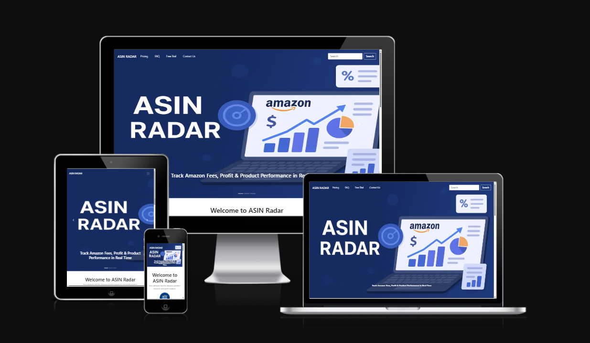

# ASIN Radar -  Testing

Visit the deployed site: [ASIN Radar](https://mubashirgit1.github.io/asinradar/)

- - -

## CONTENTS

* [AUTOMATED TESTING](#automated-testing)
  * [W3C Validator](#w3c-validator)
  * [JavaScript Validator](#javascript-validator)
  * [Lighthouse](#lighthouse)
* [MANUAL TESTING](#manual-testing)
  * [Testing User Stories](#testing-user-stories)
  * [Full Testing](#full-testing)

Testing was ongoing throughout the entire build. I utilised Chrome developer tools whilst building to pinpoint and troubleshoot any issues as I went along.

During development I made use of google developer tools to ensure everything was working correctly and to assist with troubleshooting when things were not working as expected.

I utilised the console in the developer tools to work through small sections of JavaScript and ensure that the code was working, and also to troubleshoot where issues were.

I have gone through each page using google chrome developer tools & Firefox inspector tool to ensure that each page is responsive on a variety of different screen sizes and devices.

- - -

## AUTOMATED TESTING

### W3C Validator

[W3C](https://validator.w3.org/) was used to validate the HTML on all pages of the website. It was also used to validate the CSS.

* [index.html](assets/testing/htmlvalidator/home.png) - Passed.
* [pricing.html](assets/testing/htmlvalidator/pricing.png) - Passed, . 
* [faq.html](assets/testing/htmlvalidator/faq.png) - Passed.
* [app.html](assets/testing/htmlvalidator/app.png) - Passed.
* [contact.html](assets/testing/htmlvalidator/contact.png) - Passed.
* [thanks.html](assets/testing/htmlvalidator/thanks.png) - Passed.

* [style.css](assets/testing/w3css/css-validation.png) - Passed, no errors found.

- - -

### JavaScript Validator

[jshint](https://jshint.com/) was used to validate the JavaScript.

* [javascript.js](assets/testing/jshint/jsvalidate.png) - Passed.

- - -

### Lighthouse

I used Lighthouse within the Chrome Developer Tools to test the performance, accessibility, best practices and SEO of the website.

### Desktop Results

All pages of the site are achieving a score of 100 across the 4 categories.

### Mobile Results

Each page is achieving a score of 100 for the last three categories. The performance category is achieving a score of 98 for the first three pages and a score of 99 on the 404 & 500 page.

- - -
## MANUAL TESTING

Manual testing was conducted to ensure the application works as expected based on real-world usage scenarios.

### Testing User Stories

Below are the key user stories tested manually:

#### ✅ User Story 1: Search Product by ASIN
**As** a seller  
**I want to** enter an ASIN  
**So that** I can view product details like title, brand, image, price, etc.

- [x] Entered valid ASIN → Product details displayed correctly
- [x] Entered invalid ASIN → Appropriate error message shown

#### ✅ User Story 2: View Country-Specific Results
**As** a seller  
**I want to** search ASINs by country (UK, US)  
**So that** I can see marketplace-specific results

- [x] Searched ASIN for Amazon UK → Correct regional data displayed
- [x] Searched ASIN for Amazon US → Correct data shown for US

#### ✅ User Story 3: Calculate FBA Fees
**As** a seller  
**I want to** see fulfillment costs  
**So that** I can estimate my profit margin

- [x] Entered price and dimensions → FBA fees calculated accurately
- [x] Edge case (zero price) → Handled gracefully

#### ✅ User Story 4: See Product Variations
**As** a seller  
**I want to** view all product variations  
**So that** I can choose the correct variant for listing or tracking

- [x] Multiple variations listed clearly (color, size)
- [x] Selected variation updates displayed data

#### ✅ User Story 5: Search by Product Name or Category (Upcoming Feature)
**As** a seller  
**I want to** search by category or product name  
**So that** I can explore more products

- [ ] Currently not implemented (planned feature)

---

### Additional Manual Test Cases

- [x] All input fields validate properly
- [x] Tool works on Chrome, Firefox, and Edge
- [x] Responsive layout works on mobile and tablet

### Full Testing

Full testing was performed on the following devices:

* Laptop:
  * Macbook Pro 2021 14 inch screen
* Mobile Devices:
  * iPhone 13 pro.
  * iPhone 11 pro.
  * Phone X.

Each device tested the site using the following browsers:

* Google Chrome
* Safari
* Firefox

Additional testing was taken by friends on a variety of devices and screen sizes and hundreds of ASIN. They reported no issues when searching.

